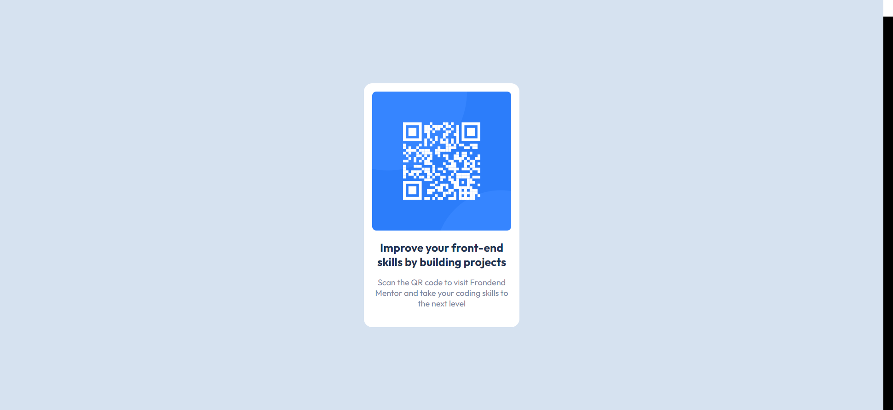
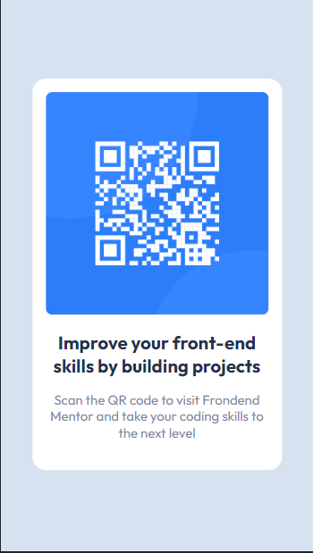

# Frontend Mentor - QR code component solution

### Screenshot

### Links

- Solution URL: [Add solution URL here](https://your-solution-url.com)
- Live Site URL: [Add live site URL here](https://your-live-site-url.com)

## My process

### Built with

- Semantic HTML5 markup
- CSS with Sass
- Flexbox
- Mobile-first workflow

### What I learned

- I wanted to do a practice for sass, which I just learned, by writing the project with sass. it was fun and beautiful!

